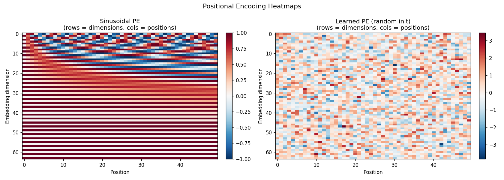
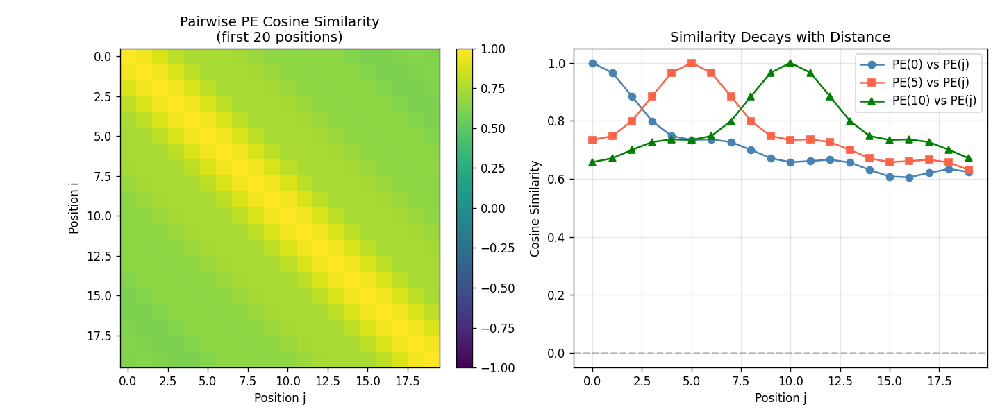

# Session Report: Positional Encoding

**Date:** 2026-05-02 18:35:51  
**Device:** cuda  

## Summary

Demonstrated that sinusoidal PE makes word-order distinguishable. Visualized PE heatmap and position-to-position cosine similarities.

## Architecture

```
SinusoidalPositionalEncoding + LearnedPositionalEncoding
```

## Hyperparameters

| Parameter | Value |
|-----------|-------|
| d_model | 64 |
| max_len | 50 |

## Metrics

| Metric | Value |
|--------|-------|
| d_model | 64 |
| max_len | 50 |
| pe_value_min | -1.0000 |
| pe_value_max | 1.0000 |
| diff_no_pe | 0.0734 |
| diff_with_pe | 0.0734 |

## Figures



