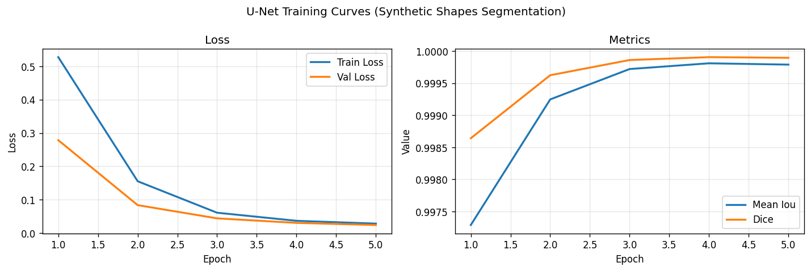
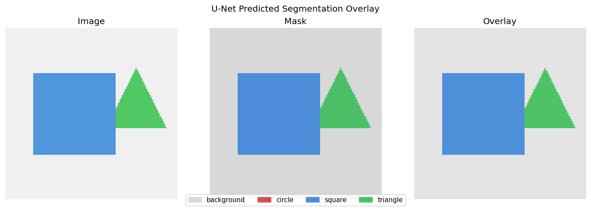
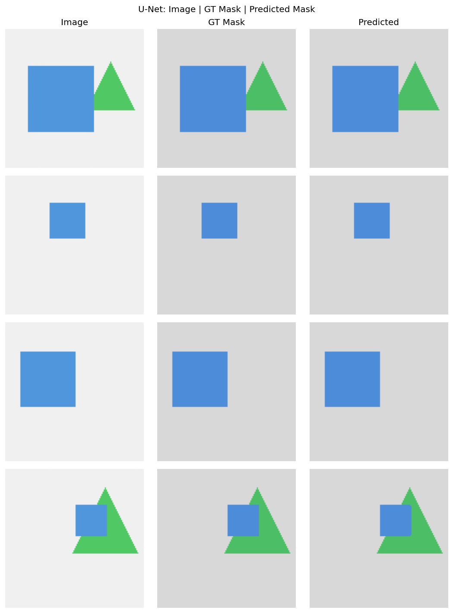

# Session Report: U-Net Semantic Segmentation

**Date:** 2026-05-03 16:13:58  
**Device:** cuda  

## Summary

UNet (base_channels=32) trained for 5 epochs on SyntheticShapes. Pixel acc: 1.0000, mean IoU: 0.9998, Dice: 0.9999.

## Architecture

```
DownBlock×3 + Bottleneck + UpBlock×3 (skip connections) + Conv1x1
```

**Loss function:** CrossEntropyLoss (pixel-wise)

## Hyperparameters

| Parameter | Value |
|-----------|-------|
| base_channels | 32 |
| image_size | 128 |
| num_classes | 4 |
| batch_size | 16 |
| epochs | 5 |
| lr | 0.001 |

## Metrics

| Metric | Value |
|--------|-------|
| pixel_accuracy | 1.0000 |
| mean_iou | 0.9998 |
| dice_score | 0.9999 |
| final_train_loss | 0.0284 |
| final_val_loss | 0.0242 |
| num_params | 1948388 |
| num_epochs | 5 |
| base_channels | 32 |

## Figures




