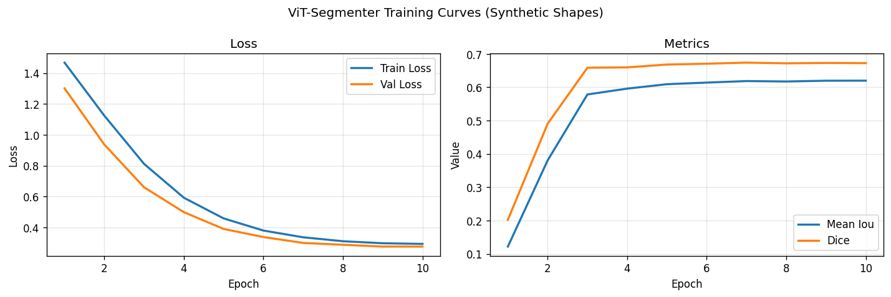
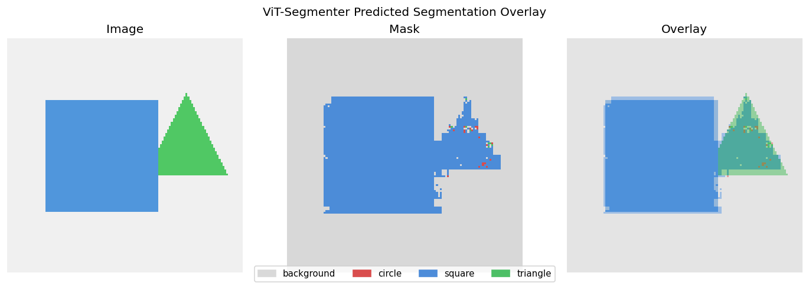
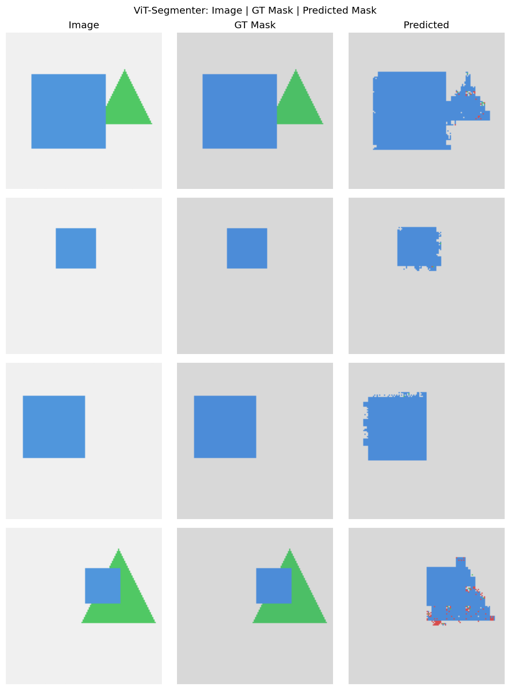

# Session Report: ViT-Segmenter — Semantic Segmentation

**Date:** 2026-05-03 16:30:28  
**Device:** cuda  

## Summary

ViTSegmenter (image_size=128, patch_size=16, d_model=64) trained for 10 epochs. Pixel acc: 0.9542, mean IoU: 0.6198, Dice: 0.6725.

## Architecture

```
PatchEmb(16→64) + SinPE + TransformerEncoder×2 → reshape(8×8) → ConvTranspose decoder(×16)
```

**Loss function:** CrossEntropyLoss (pixel-wise)

## Hyperparameters

| Parameter | Value |
|-----------|-------|
| patch_size | 16 |
| d_model | 64 |
| num_heads | 8 |
| num_layers | 2 |
| batch_size | 16 |
| epochs | 10 |
| lr | 0.0006 |

## Metrics

| Metric | Value |
|--------|-------|
| pixel_accuracy | 0.9542 |
| mean_iou | 0.6198 |
| dice_score | 0.6725 |
| final_train_loss | 0.2930 |
| final_val_loss | 0.2755 |
| num_params | 122324 |
| num_epochs | 10 |

## Figures





## Tables

- [vit_vs_unet_comparison.csv](vit_vs_unet_comparison.csv)
