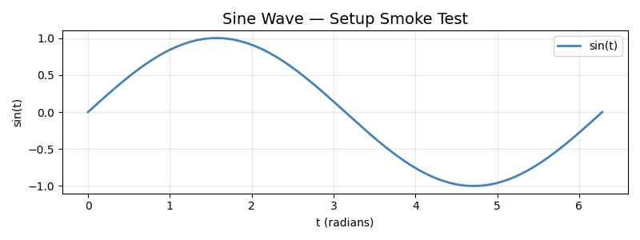

# Session Report: Course Setup

**Date:** 2026-04-30 19:14:28  
**Device:** cuda  

## Summary

Environment verified: Python, PyTorch, NumPy, Matplotlib all functional. Device selection and seed utilities confirmed.

## Metrics

| Metric | Value |
|--------|-------|
| python_version | 3.13.12 |
| pytorch_version | 2.11.0+cu130 |
| torchvision_version | 0.26.0+cu130 |
| platform | Linux |
| architecture | x86_64 |
| device | cuda |
| cuda_available | True |
| mps_available | False |

## Figures

## Tables

- [device_info.csv](device_info.csv)
