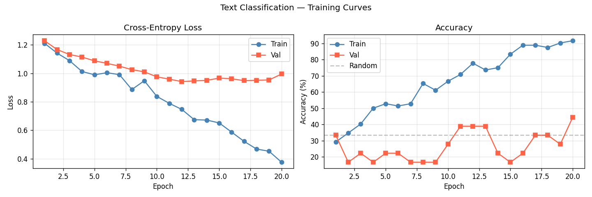
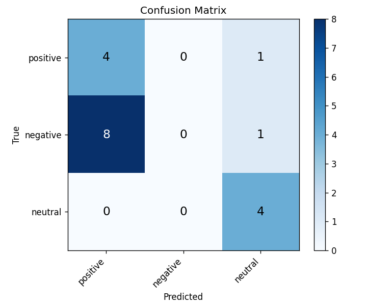

# Session Report: Text Classification

**Date:** 2026-05-02 20:45:49  
**Device:** cuda  

## Summary

TextTransformerClassifier trained for 20 epochs on tiny_sentiment.csv. Final val accuracy: 0.4444.

## Architecture

```
TextTransformerClassifier: embedding(d_model=32) + SinusoidalPE + TransformerEncoder × 1 (2 heads, FFN=64) + mean_pool + Linear(32→3)
```

**Loss function:** CrossEntropyLoss

## Hyperparameters

| Parameter | Value |
|-----------|-------|
| d_model | 32 |
| heads | 2 |
| layers | 1 |
| lr | 0.0005 |
| batch_size | 16 |
| max_len | 32 |

## Metrics

| Metric | Value |
|--------|-------|
| final_val_accuracy | 0.4444 |
| final_val_loss | 0.9951 |
| final_train_loss | 0.3750 |
| num_epochs | 20 |
| vocab_size | 235 |
| num_params | 16099 |

## Figures



