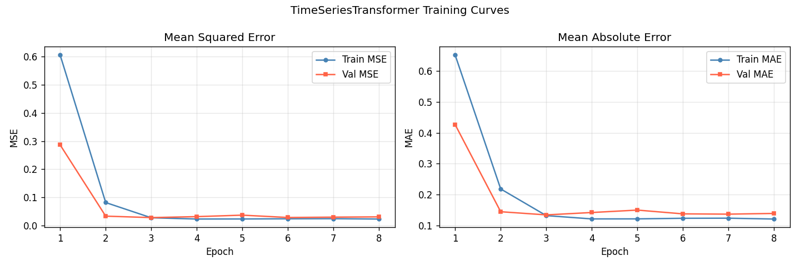
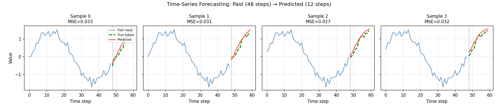
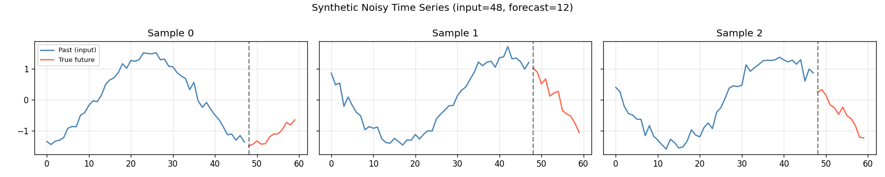

# Session Report: Time-Series Forecasting

**Date:** 2026-05-03 13:03:57  
**Device:** cuda  

## Summary

TimeSeriesTransformer trained for 8 epochs on synthetic noisy sine waves. Final val MSE: 0.0322, MAE: 0.1434.

## Architecture

```
TimeSeriesTransformer: Linear(1→d_model) + SinPE + TransformerEncoder×2 + mean_pool + MLP(d_model→forecast_length)
```

**Loss function:** MSELoss

## Hyperparameters

| Parameter | Value |
|-----------|-------|
| d_model | 64 |
| num_heads | 4 |
| num_layers | 2 |
| input_length | 48 |
| forecast_length | 12 |
| lr | 0.001 |
| batch_size | 32 |

## Metrics

| Metric | Value |
|--------|-------|
| final_val_mse | 0.0322 |
| final_val_mae | 0.1434 |
| final_train_mse | 0.0232 |
| num_epochs | 8 |
| input_length | 48 |
| forecast_length | 12 |
| num_params | 76556 |

## Figures




