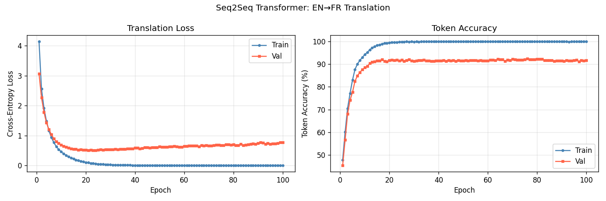
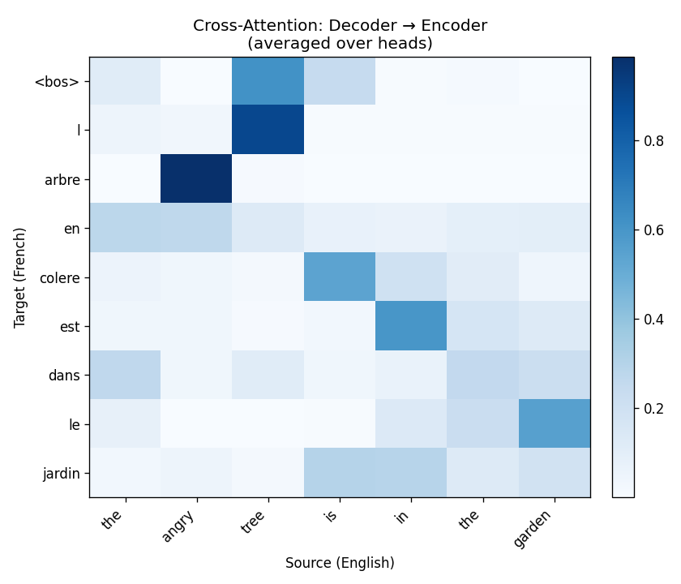

# Session Report: EN→FR Translation

**Date:** 2026-05-03 12:54:57  
**Device:** cuda  

## Summary

Seq2SeqTransformer trained for 100 epochs. Best epoch: 23. Best val loss: 0.5106, best token acc: 0.9176.

## Architecture

```
Seq2SeqTransformer: src_emb(d_model=96) + PE + Encoder × 2 | tgt_emb(d_model=96) + PE + Decoder × 2 + projection(96→302)
```

**Loss function:** CrossEntropyLoss (ignore_index=PAD)

## Hyperparameters

| Parameter | Value |
|-----------|-------|
| d_model | 96 |
| heads | 4 |
| enc_layers | 2 |
| dec_layers | 2 |
| dim_feedforward | 256 |
| lr | 0.0003 |
| batch_size | 16 |
| max_src_len | 12 |
| max_tgt_len | 12 |

## Metrics

| Metric | Value |
|--------|-------|
| best_epoch | 23 |
| best_val_loss | 0.5106 |
| best_val_token_acc | 0.9176 |
| final_val_loss_last_epoch | 0.7738 |
| final_val_token_acc_last_epoch | 0.9162 |
| final_train_loss | 0.0027 |
| num_epochs | 100 |
| src_vocab_size | 240 |
| tgt_vocab_size | 302 |
| num_params | 502830 |

## Figures




## Tables

- [translation_examples.csv](translation_examples.csv)
