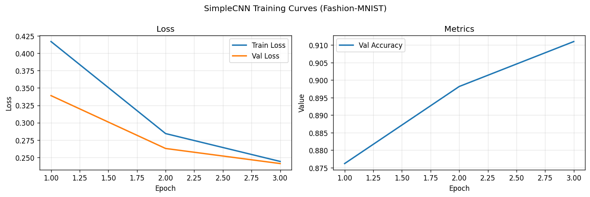
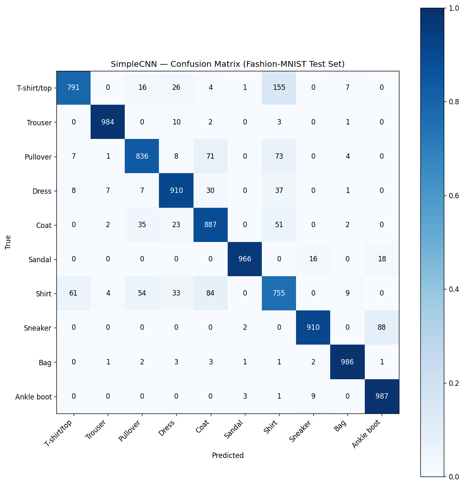
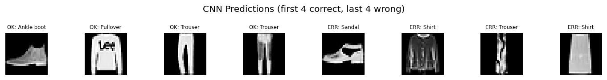

# Session Report: CNN Baseline — Fashion-MNIST Classification

**Date:** 2026-05-03 16:04:21  
**Device:** cuda  

## Summary

SimpleCNN trained for 3 epochs on Fashion-MNIST. Test accuracy: 90.12%. Model has 824,650 trainable parameters.

## Architecture

```
Conv(1→32)+BN+ReLU+Pool → Conv(32→64)+BN+ReLU+Pool → Flatten → Linear(3136→256) → Linear(256→10)
```

**Loss function:** CrossEntropyLoss

## Hyperparameters

| Parameter | Value |
|-----------|-------|
| batch_size | 64 |
| epochs | 3 |
| lr | 0.001 |

## Metrics

| Metric | Value |
|--------|-------|
| test_accuracy | 0.9012 |
| final_val_accuracy | 0.9110 |
| final_train_loss | 0.2441 |
| final_val_loss | 0.2411 |
| num_params | 824650 |
| num_epochs | 3 |
| batch_size | 64 |
| lr | 0.0010 |

## Figures




