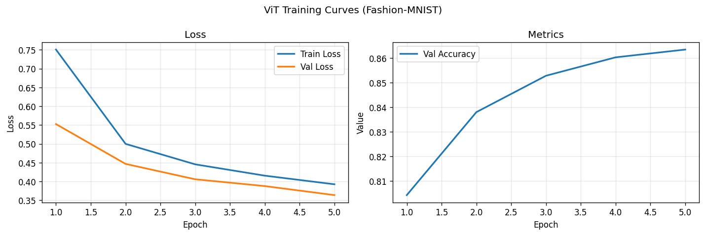
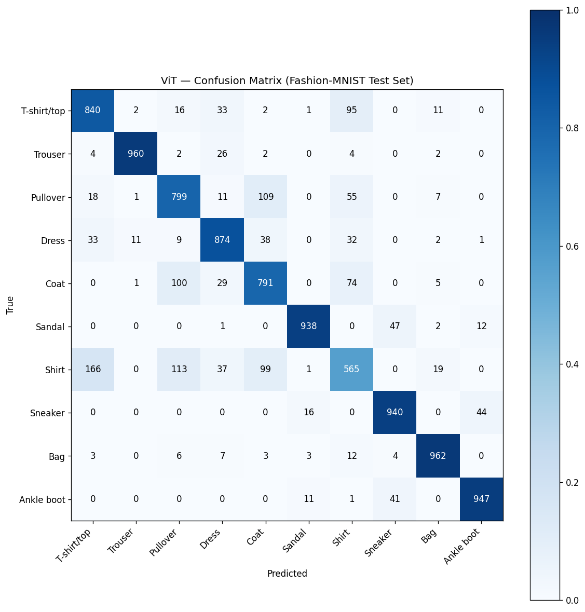
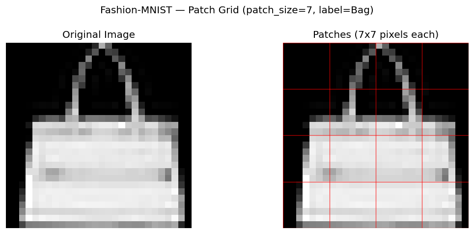
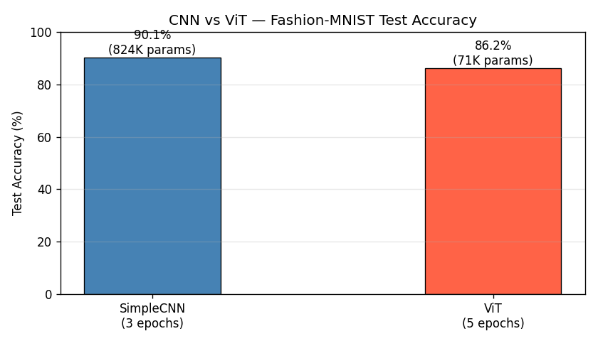

# Session Report: Vision Transformer — Fashion-MNIST Classification

**Date:** 2026-05-03 16:11:05  
**Device:** cuda  

## Summary

ViT (image_size=28, patch_size=7, d_model=64) trained for 5 epochs. Test accuracy: 86.16%. 71,690 trainable parameters.

## Architecture

```
PatchEmbedding(7→64) + CLS + LearnedPE + TransformerEncoder×2 + CLS→Linear(64→10)
```

**Loss function:** CrossEntropyLoss

## Hyperparameters

| Parameter | Value |
|-----------|-------|
| patch_size | 7 |
| d_model | 64 |
| num_heads | 4 |
| num_layers | 2 |
| batch_size | 64 |
| epochs | 5 |
| lr | 0.001 |

## Metrics

| Metric | Value |
|--------|-------|
| test_accuracy | 0.8616 |
| final_val_accuracy | 0.8635 |
| final_train_loss | 0.3924 |
| final_val_loss | 0.3636 |
| num_params | 71690 |
| num_epochs | 5 |
| batch_size | 64 |
| lr | 0.0010 |
| patch_size | 7 |
| d_model | 64 |

## Figures





